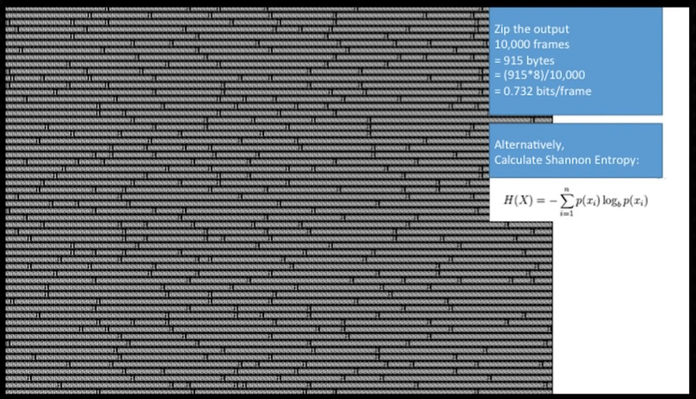

---

### {#title data-background-image="img/Information_Slide.png" data-background-size=contain data-background-transition=none}

---

### {#title-video data-background-video="img/Information_Slide.webm" data-background-size=contain data-background-video-loop="loop"}

---

### What Is?

Understanding the movement and transformation of information through mathematical and physical laws, addressing and answering two fundamental questions:

. . .

  1. **How can much can you compress data? (The entropy of the data, H).**

. . .

  2. At which rate can you reliable communicate through a channel? (The channel capacity, C).

::: notes

What is information theory?

We will only cover the first question. Question two can be saved for further reading, or a later talk...

:::

---

### Why Do?

Widely Applicable! (Sneak Peak):

. . .

  - Compression (duh!)
  - Communications and Networking (duh!)
  - Data-Oriented Design
  - Security
  - Machine Learning (huh?)
  - Computer Vision (huh?)
  - Computer Graphics (huh!?)
  - ^^ Almost Everything in Computer Science

::: notes

Information Theory has some pretty obvious applications, but hopefully some here will surprise you!

*click*

We will be delving into the more interesting links later, and go in depth on these.

Outside of Computer Science, relevant to subjects from linguistics, to physics and how the universe itself works!

:::

---

### What Contains?

  - Foundations: Intro, Bayes, Entropy, Shannon's Source Coding Theorem
  - Applications: Codes, Compression
  - Relations: DoD, Security, ML, Graphics

. . .

*Not* mathematically rigorous!
Arguments rely on intuition, *not* formal proof.
User-friendly, *not* technically precise.

::: notes

Very high level overview, will give you taste of what doors Information theory opens-up.

Applicable outside of Computer Science, is important to understanding reality itself!

*click*

Not maths accurate!

:::


## Foundations

---

### Data Is Not Information

**Intuition:** A new hard drive has 1,000,000,000,000 bits of data, but not 1,000,000,000,000 bits *of information*.

Is there a difference between a 0-initialized hard drive, and a randomly-initialized hard drive in terms of information?

::: notes

This concept makes sense to use intuitively.

Answer to question, yes, if you care about the value of the bits on the randomly-initialized hard drive.

But this does hint an something interesting regarding information...

:::

---

### Probabilities Matter

The less probable an event is, the more information it contains when it happens.

::: notes

Intuition: I tell you my name is Tom, the fact that you were expecting that means that the particular piece of information that I go by that name now isn't very high.

However, if I were to tell you that my name is now Geoffrey, that would be more information.

:::

---

### 1 Bit ≠ 1 Bit

1 Bit of Data is not 1 Bit of Information.

. . .

We can say that 1 Bit of Data contains 1 Bit of Information if the probability of that Bit being 1 or 0 is 0.5.

::: notes

Clickbait title! 1 Bit is not 1 Bit?

*click*

We will expand on what that is later. But this is the core of things like compression algorithms, if the probabilities of any bit in a bit stream being a given value isn't 0.5 what does that mean?

You will understand this later.

:::

---

### Knowledge Affects Information

Intuitively, past events affect the probabilities by which we predict future events.

. . .

In othr wrds, yo cn rd ths sntnce evn wth mssng lttrs.

::: notes

Here's intuitively why probability is important

*click*

The reason why you can read this sentence is because there are probabilies associated with what the missing letters could be, and your brain automatically fills in the gaps with the most likely options.

I find it awesome that our brains can run super-hardcore bayesian inference like that without us even thinking about it.

:::


## Some Probability

::: notes

We are going to delve into some probability basics.

Bear with me as this is important to understand, I'm going to go over this thoroughly as it helps a lot. But if you do get lost, I will stick to intuitive explanations for the rest of the talk.

Information Theory is *defined by* probability, because as we will discover, information *is* entropy *is* randomness.

:::

---

### Basic Syntax - $p(A)$

For some event $A$, $p(A)$ says how likely that event is to occur.

. . .

In other words, $p(A)$ represents the probability that $A$ will happen.

. . .

$p(um)=1$

::: notes

Read Slide

*click*

Read Slide

*click*

If the event is that I will use say "umm" during this talk, then we can say that the probability of "umm", p(um), is 1.

:::

---

### Basic Syntax - $p(A,B)$

For events $A$ and $B$, $p(A,B)$ is how likely both events are to happen.

. . .

Hopefully $p(talk,swear)$ is low.

::: notes

*click*

Probability I will give this talk *and* swear, is low.

:::

---

### Basic Syntax - $p(A|B)$

For events $A$ and $B$, $p(A|B)$ is how likely $A$ is to happen, if $B$ has happened.

. . .

$p(swear|stub toe)$ is very high.

::: notes

*click*

Let's hope I don't stub my toe during this talk.

:::

---

### Product Rule

The probability that both *A* and *B* will happen:

$$p(A,B) = p(A|B)p(B) = p(B|A)p(A)$$

. . .

Example: The Probability that Alice will buy a hot dog *and* ketchup?

::: notes

*click*

If we know the probability of Alice buying ketchup given that she's bought a hot dog. *And* we know how likely she is to buy a hot dog. Then we know how likely *both* are to happen.

:::

---

### Sum Rule

If the probability of A is affected by the outcome of a number of events *B*

$$p(A) = \sum\limits_{B} p(A,B) = \sum_{B} p(A|B)p(B)$$

. . .

Example: The Probability that Bob will beat Alice at chess.

::: notes

*click*

If we know the probability that Bob will beat Alice when starting with whites, and the probability that Bob will beat Alice when starting with blacks - then we know the probability that Bob will beat Alice if we know how likely he is to start with either of those colours.

:::

---

### Bayes' Theorem

The Product Rule:

$$p(A,B) = p(A|B)p(B) = p(B|A)p(A)$$

. . .

Gives us...

. . .

$$p(B|A) = \frac{p(A|B)(p(B)}{p(A)}$$

::: notes

Refresh on product rule

*click*


*click*

This is very powerful, because it allows us to reverse the conditions of events.

:::

---

### Close to Home Example

Imagine a 90% accurate "virus immunity" test.

. . .

Imagine 1% of population is *actually* immune to the virus.

. . .

What is the probability you are immune, if the test is positive?

. . .

$$p(I|T)$$

::: notes

*click*

*click*

Write down your guess in the comments, your gut feeling.

:::

---

### Test Variables

- $p(I)=0.01$ - Chance you are immune.
- $p(\overline{I})=0.99$ - Chance you are at risk.
- $p(T|I)=p(\overline{T}|\overline{I})=0.9$ - Chance tests succeed.
- $p(\overline{T}|I)=p(T|\overline{I})=0.1$ - Chance tests fail.

::: notes

Stating chances we already know.

:::

### Applying Bayes'

$$p(I|T)=\frac{p(T|I)p(I)}{p(T)}$$

. . .

- $p(T)=...$
- $=p(T|I)p(I)+p(T|\overline{I})p(\overline{I})$ (sum rule)
- $=(0.9)(0.01)+(0.1)(0.99)$
- $=0.108$


::: notes

We need $p(T) then...

*click*

:::

---

### Are You Immune?

$$p(I|T)=\frac{p(T|I)p(I)}{p(T)}=\frac{(0.9)(0.01)}{0.108}=...$$

. . .

$$0.833$$

::: notes

Are you immune? Here's the math!

*click*

You have less than 10% chance of being immune. Even though your test was 90% accurate.

:::


---

### Relation to Information Theory

Bayes' Theorem can be applied recursively to let us use the latest posterior as a new *prior* so interpret the next set of data.

. . .

Information Theory is about quantitatively analysing the amount of information gained (via analysing reduced uncertainty) using Bayes' Theorem.

::: notes

Bayes' theorem let's us estimate the probalities of incoming bits of information

*click*

Information theory is all about quantiviely analysing that.

:::


## Entropy

---

### Event Information

The information $I$ contained within an event $E$ is:

. . .

$$I = \log_2(p(E))$$

Where $p(E)$ is the probability of that event occurring.

. . .

Entropy, $H = -I$ is the the amount of uncertainty.

::: notes

So, there is an equation for information, and this...

*click*

So, it seems pretty arbitrary to have this. And also it's negative. We also talk about Entropy though, which, intuitively, is anti-information so...

*click*

However, these numbers mean very real things. The next slide will explain why log is useful, but eventually the magic will be revealed...

:::

---

### Adding Information

For independent $a$ and $b$:

$$I_{ab} = \log_2(p_a p_b) = \log_2(p_a) + \log_2(p_b) = I_a + I_b$$

::: notes

By defining information in terms of the logarithms of the underlying probabilities involved, we can "add" information together to get the total information gain of two events.

:::

### Entropy of Ensembles

If you have non-uniform ensemble of probabilities such that:

$$\sum\limits_i p_i = 1 $$

Then:

$$H = - \sum\limits_i p_i \log_2(p_i)$$


::: notes

TODO: Intuition

:::

### Intuition of Entropy

::: {style='font-size: 0.7em'}

Bit, $b$ with $p_{b=1}=1-p_{b=0}$

:::


. . .


::: {style='font-size: 0.7em'}

```{.matplotlib
  caption="$$H(b)=-p_{b=1}\log_2(p_{b=1})-(1-p_{b=0})\log_2(1-p_{b=0})$$"
  height="330px"
  transparent=true
}

import matplotlib.pyplot as plt
import numpy as np
import math

entropy = lambda p: p * math.log(p, 2) * -1

p_values = list(np.arange(0.01, 1.00, 0.01))
hp_values = list(map(lambda p: entropy(p) + entropy(1 -p), p_values))
plt.figure()
plt.xlabel("p(b=1)")
plt.ylabel("H(b)")
plt.plot(p_values, hp_values)
```

When $p=0.5$, the Entropy maxes-out at 1.

:::

::: notes

Excuse the inconsistent syntax, it's denser this way.

We are saying that we have a bit *of data* b, that can either be one or zero. And it can only have two values.

. . .

Bring that back to earlier when we said that 1 bit of data contains 1 bit of information if the probability of it being 1 or 0 was 0.5, this is why!

:::


### Further Entropy Reading

- Joint Entropy
- Conditional Entropy of Ensembles
- Chain Rule for Entropy
- Mutual Information
- Kullback-Leibler Distance and Fano's Inequality


## Source-Coding

::: notes

This section will explain why we all 1 bit of information, a 'bit'.

:::

---

### Codes

Imagine Alice sending Bob $A$, $B$, $C$ and $D$, with:

::: incremental

- $p(A)=\frac{1}{2}$
- $p(B)=\frac{1}{4}$
- $p(C)=\frac{1}{8}$
- $p(D)=\frac{1}{8}$

:::

. . .

Example: DADDBBADAABBAACBDABCAAADC

::: notes

Let's say Alice is send Bob a sequence letters, "A, B, C & D".

*click*

Where the probability she will send A is a half.

*click*

B is a quarter

*click*

C is 1/8

*click*

D is 1/8

*click*

With an example (generated randomly!)

:::

---

### Encoding as Binary

. . .

A naive code might look like this:

- $A = 00$
- $B = 01$
- $C = 10$
- $D = 11$

. . .

This has a fixed *code rate*, (the mean number of bits transmitted), $R=2$.

::: notes

How would we encode this as binary?

*click*

We have four letters, so we can use two bits per letter right?

*click*

So this has what we call a "Fixed Code Rate", that is, on average, for each letter transmitted, we will send two bits and always send two bits! We call this R.

:::

---

### Entropy of the system

Remember:

$$H = - \sum\limits_i p_i \log_2(p_i)$$

::: incremental

- $H=...$
- $=H(A)+H(B)+H(C)+H(D)$
- $=-\frac{1}{2}-\frac{1}{4}2-\frac{1}{8}3-\frac{1}{8}3$
- $=-\frac{1}{2}-\frac{1}{2}-\frac{3}{8}-\frac{3}{8}$
- $=-1.75$

:::

::: notes

So what is the entropy of this system then? Although it still seems like we are plugging arbitrary numbers into equations, it will all make sense!

So we are calculating the entropy of an ensemble here, so here we go!

*click*

(once all clicked)

So what does this mean? It means that on average, in our system, each symbol carries 1.75 bits of information.

So what does that tell us about our code?

:::

---

### Coding Efficiency

The efficiency $\mu$ of our coding is $\mu=\frac{H}{R}$:

$$\mu=1.75/2=0.875$$

::: notes

The implication is that a coding *should* exist that itself has a coding rate $R=H$, and if we can find-it, it will be optimal.

So yeah, maybe there is a different code with a code rate R of 1.75?

:::

---

### Variable-Length Coding

Now imagine:

- $A = 0$
- $B = 10$
- $C = 110$
- $D = 111$

. . .

$$R=p(A)+2p(B)+3p(C)+3p(D)$$

. . .

$$=1.75$$

::: notes

So here's one I made earlier.

Explain variable length coding, and useful properties (each symbol uniquely and instantaneously decodable).

Now, if we were to calculate the likely hood each instance of this code is to appear, and how their cost, what is
the code rate now?

*click*

Explain probabilities calculation.

*click*

Look, R matches the entropy of this system!

Aside: So, this code was plucked out-of thin air, but it has some important properties that make it work.

Firstly, if we tried to find a code with a lower coding-rate, we can't, because that's impossible to do without losing information, so we know this is the most maximally efficient code.

It's also instantly decodable, no symbol encoding is prefix of another symbol, so we don't need to wait for further messages.

These things can be easy to mess up in more complex situations, and there are systems for constructing codes like this (such as huffman trees).

:::


---

### Shannon's Source-Coding Theorem

*You can compress a stream of data with entropy $H$ into a code whose rate $R$ approaches $H$ in the limit, but you can't have a code rate $R < H$ without loss of information.*

---

### On Fixed Probabilities

Probabilities in symbol streams rarely fixed

- Could be affected by previous symbol ($p(U|Q)$ is high!)
- Can be dependant on context, the *type* of data: photos vs cartoons.
- Can depend on recipient, do they know what you are going to send?

::: notes

The goal of encryption is transmit data in such a way that it contains no information for anyone except the intended receiver.

This is unfortunately the limits we will get to with lossless compression, but you can see the foundations of a mathematical system for understanding this stuff.

Good compression systems are as much about trying to accurately *discern* the entropy of each symbol for the target recipient.

:::

---

### Further Coding Reading

- Huffman Codes & Huffman Trees
- Kraft-McMillan Inequality
- Markov Chains


## Compression

::: notes

Coding covers how different ways of coding the same data can make it more or less efficient, but how does this apply to general-purpose compression?

:::

---

### Compression is... hard

- We want to find out the best estimate $p(B_{n+1}|B_{0..n})$, for the recipient...
- Context is key, the more specific you can be the more information you already have.
  - General purpose?
  - Images Only?
  - Cartoons Only?
  - Only Simpsons Characters?


::: notes

- About finding and encoding probabilities
- Dictionary-Based, assume what comes before will come again.
- Run length-encoding, assume things won't change
- Tom Scott Video Compression
- Learning Compressors, Give example data, they compress it.

:::

---

### Dictionary Method - Assume Repeated Patterns {data-background-image="img/dictionary.jpg" style="color:black; text-shadow: 0px 0px 4px white;"}

(LZW, gif)

Every time a new "word" is encountered, put it in a dictionary. Next time you encounter it, refer to the dictionary entry.

. . .

Constructing the "best" dictionary is hard.

. . .

Image Source: [freestocks.org](https://www.pexels.com/@freestocks)


---

### Run-Length Encoding

Assume data will often be repeated, so count number of repeated bytes and store that and first instance.

. . .

$$000000000001111000=(11)0, (4)1, 3(0)$$

---

### Learning Compressors

Train compressor for specific-use case.

. . .

[Oodle Network Compression](http://www.radgametools.com/oodlenetwork.htm) does this by building dictionary for network packets ahead-of-time that is shipped with the game.


---

### Lossy Compression {data-background-image="img/compress_cat.jpg" style="color:white; text-shadow: 0px 0px 4px black;"}

Really good for images/videos - goal is to throw away information that our eyes tend to naturally discard anyway.

. . .

JPEG uses FFT to achieve this example.

. . .

A broad topic, that can be expanded on at a later date.

. . .

Image Source: [Wikipedia](https://en.wikipedia.org/wiki/Lossy_compression#/media/File:Ruby-HighCompression-Tiny.jpg)


## Relations

---


### Original List

Case Studies

  - Compression (duh!)
  - Communications and Networking (duh!) (next time)
  - Data-Oriented Design
  - Security
  - Machine Learning (huh?)
  - Computer Vision (huh?)
  - Computer Graphics (huh!?)
  - ^^ Almost Everything in Computer Science

---

### Data-Oriented Design [@ActonMike2014]

A strongly recommended talk from CppCon in 2014.

. . .

{width=450}

Information Density in context is important for Data-Oriented Design!

::: notes

Mike Acton gave a really good talk in 2014 strong advocating software engineering by focusing on "solving the problem you have to solve" - identifying that all software problems are ultimately problems of data transformation on a concrete set of hardware.

With Modern CPUs, this means the focus is often on transforming data in a way that makes effective use of CPU caches.

Being able to reason about information density is an important part of that.

*click*

Not only do you have the problem of the cache misses caused by computing a single bit each frame, but the information density here is incredibly low on top of that!

I would strongly recommended watch the full talk if you want to learn more.

:::

---

### Security - Encryption

](img/keys_george_becker.jpg){width=600}

Goal: Meaningful *only* to the intended recipient.

::: notes

Encryption is all about encoding information so that only someone with the right *priors* can extract meaning from it. From an information theory point-of-view it's still the same *amount* of information from a probability perspective.

Public-key cryptography is a really interesting case.

When you broadcast information encrypted using someone's public key, everyone is receiving that information with the same density. However, only the person with the right corresponding private key can decrypt it.

What's fascinating here is that the public key *is* an encoding of the private key - but the work involved to extract that information just requires a lot of energy. All the information you might need to acquire the private key is there, you just can't access it.

:::

---

### Machine Learning + Computer Graphics - DLSS [@NvidiaDlss2020]


::: notes

Machine Learning Image Upscaling works because a 4x increase in image resolution does not make for a 4x increase in information - so computing that data every frame is wasteful.

By training a neural network known as a "Convolutional Autoencoder" on examples of low-resolution and high-resolution images, we can make pretty good-looking reconstructions of high-resolution images from low-resolution ones.

By feeding in historical data and motion vectors from previous frames, we can even reconstruct some higher-frequency data that would otherwise be aliased.

:::


---

### ~~Computer~~ Vision - How the eye works[@WikiBlindSpot]

. . .

{fontsize=10}


::: notes

Human vision is a wide and broad topic, but our brains and retinas exploit information theory *a lot* for in an attempt to efficiently allow us to *see* informationally rich images from relatively low-resolution data sources which contain a lot of noise, missing pixels, limited bandwidth, the wrong colours, etc.

*click*

Testing the process going wrong is where it gets interest. Everyone follow these instructions:

Close one eye and focus the other on the appropriate letter (R for right or L for left). Place your eye a distance from the screen approximately equal to three times the distance between the R and the L. Move your eye towards or away from the screen until you notice the other letter disappear. For example, close your right eye, look at the "L" with your left eye, and the "R" will disappear.

It's amazing, our brain is filling in the data with what it "expects" to be there with the highest probability, only, it gets it wrong.

:::

---

### Bonus: The Universe Itself!?

](img/universe_miriam_espacio.jpg){width=600}

::: notes

One of the things that makes Information Theory hold a special place in my heart is the fact that it gives us a really interesting insight into the laws of the Universe itself.

We live in a world that (as far as we know) is trending towards a state of entropy. We have established that no information at all, is the completely uniform and expected, so it seems like more and more information is constantly being added to the Universe within which we live.

Yet, information needs meaning, and in the march towards more entropy, towards more information, it takes work to keep information around. And with channel coding, it takes work to transmit it.

It's fascinating that packing data into the smallest number of bits needed to store useful information takes work, energy, CPU time, electricity. It's even more so that unpacking information from that form requires just as much work - to extract meaning we need to reintroduce redundancy.

This is the foundation for efficiently distributing videos of cats around the internet, yet it's hard not get lost in this when your mind wanders onto the topic.

:::


## The End

::: notes

I hope you found this interesting and it has piqued your interest for more on information theory. There are links in the description for further watching and reading.

:::

---

### Special Thanks

- Professor John Daugman for teaching this course at University.
- Thomas Van Nuffel for the amazing title slide.
- Henry Ryder for design feedback and assistance.
- Alastair Toft & AJ Weeks for ideas bouncing and feedback.
- Huw Bowles for organising these talks and providing invaluable feedback.

---

### Social Media

Subscribe to our [YouTube Channel](https://www.youtube.com/channel/UCahevy2N_tj_ZOdsByl9L-A)!

More talks available! Chips! Git!

---

### Further Watching

- [What is NOT Random?](https://www.youtube.com/watch?v=sMb00lz-IfE) - Veritasium
- [Why Black Holes Could Delete The Universe](https://www.youtube.com/watch?v=yWO-cvGETRQ) - Kurzgesagt
- [Intro to Information Theory](https://www.youtube.com/watch?v=_PG-jJKB_do) - Up and Atom
- [Why Snow and Confetti Ruin YouTube Video Quality](https://www.youtube.com/watch?v=r6Rp-uo6HmI) - Tom Scott

---

### References

::: {#refs style='font-size: 0.5em'}
:::


### Careers {data-background-color="#000"}

::: {style='font-size: 0.7em'}

Electric Square welcomes ambition and talent at every level. With a focus on collaboration we ensure that everyone benefits from a diverse range of skills and experience.

- 150+ staff across 4 projects
- Brighton, Leamington Spa, Singapore
- Expertise in Free-To-Play and Live Ops
- Track record for quality & innovation
- Experience managing top IP

[careers@electricsquare.com](mailto:careers@electricsquare.com)

[https://www.electricsquare.com/careers/](https://www.electricsquare.com/careers/)

:::

::: notes

If you have watched this online and found this interesting, please do consider applying for a job at Electric Square! It's a great place to work.

We have positions open for all levels of programmer, from Junior through to Technical Director, including research and development roles.

Electric Square has studios in Brighton, Leamington Spa, and Singapore.

:::

### Q&A


